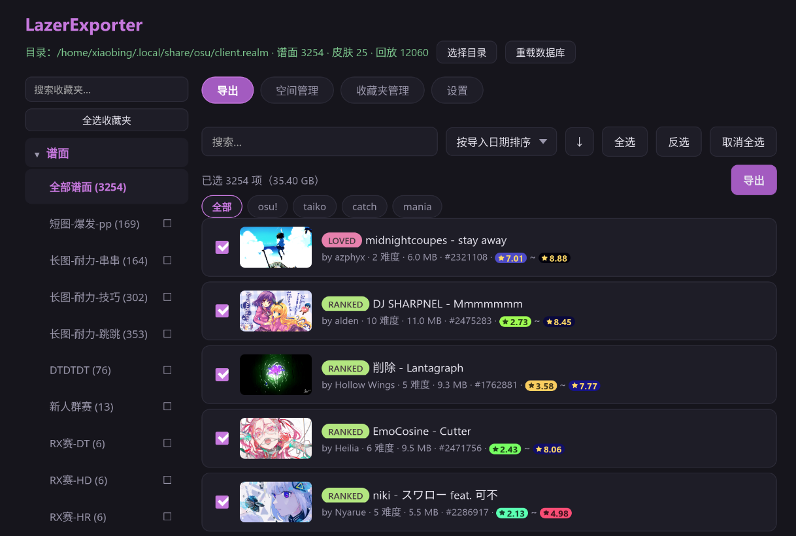

<div align="center">


# LazerExporter

osu!lazer 本地数据导出与管理工具。

</div>



直接只读解析 lazer 的 `client.realm` 数据库,把谱面、皮肤、回放导出为可直接使用的文件,并提供收藏夹管理与压缩空间功能

## 功能

### 导出

- **谱面** → `.osz` 压缩包或文件夹(可选硬链接,不占额外空间、瞬间完成)
- **皮肤** → `.osk` 压缩包或文件夹
- **回放** → `.osr` 文件

### 谱面库浏览

- 自动检测 lazer 数据目录(Windows `%APPDATA%\osu`、Linux `~/.local/share/osu`),也可手动指定
- 封面懒加载/无图模式
- 游戏模式筛选
- 排序

### 搜索

支持表达式与普通关键词混合:

| 示例 | 说明 |
|---|---|
| `star>7` / `star=5-6` | 星级比较 / 区间 |
| `ar>=9` `cs<4` `od=9` `hp>8` | 难度属性 |
| `bpm>200` `length<2m` `divisor=4` | BPM / 时长(支持 `90s`/`2m`/`1m30s`)/ 节拍分割 |
| `status=ranked\|loved` | 在线状态(支持 `\|` 多值) |
| `mode=taiko` | 模式(含 catch/ctb/standard 别名) |
| `creator=mapper名` `artist=xxx` `title=xxx` `diff=难度名` `source=` `tag=` | 文本字段(`!=` 为排除) |
| `"精确短语"!` `[难度名]` | 精确匹配 / 难度名标签 |

同时匹配罗马字与 Unicode 名称

### 收藏夹管理

- 读取 lazer 收藏夹(client.realm)与 stable `collection.db`, `osu!.db` 
- 谱面级操作:勾选、shift 范围选择、全选/反选/取消、集合级整组选择
- **工作副本模式**:所有修改写入 `collection.export.db` 副本,原 `collection.db` 永不改动;确认后可"导出 collection.db"(保存对话框,可重命名/替换)落地
- 复制所选到 collection.db(追加/替换)、右键删除谱面/收藏夹、"导出所选集合谱面"

### 空间管理

- **磁盘占用统计**:总大小 vs 实际占用(排除与 stable 共享的硬链接)
- **压缩空间**:扫描 stable 谱面目录,把 lazer 中内容完全一致(SHA-256 校验)的重复文件替换为指向 stable 的硬链接,释放重复占用;支持仅预览(试运行)、进度与终止、跨分区自动跳过

## 技术栈

- **前端**:TypeScript + Vite(无框架)
- **后端**:Rust + Tauri 2
- [realm-db-reader](https://github.com/Ohdmire/realm-db-reader):只读解析 `client.realm`
- [osu-db](https://github.com/kovaxis/osu-db):读写 `collection.db`、解析 `osu!.db`

## 构建

依赖:Rust、Node.js / pnpm、Linux 上需要 WebKitGTK 开发库(Tauri 系统依赖)。

```bash
pnpm install          # 或 npm install

# 开发(如遇 Wayland 下 WebKit 报错,加环境变量)
WEBKIT_DISABLE_DMABUF_RENDERER=1 pnpm tauri dev

# 发布:单二进制(前端已嵌入,直接运行)
cd src-tauri && cargo build --release

# 或打包安装包(AppImage/deb/rpm)
pnpm tauri build
```

## 目录约定

| 内容 | 位置 |
|---|---|
| lazer 数据根(自动) | Windows `%APPDATA%\osu` / Linux `~/.local/share/osu` |
| 文件存储(含 `client.realm`) | 数据根,或其 `storage.ini` 的 `FullPath` 所指目录 |
| stable 根 | 用户指定(需含 `osu!.db`;选中 `Songs` 子目录也可自动回溯) |
| collection 工作副本 | stable 目录下 `collection.export.db` |
